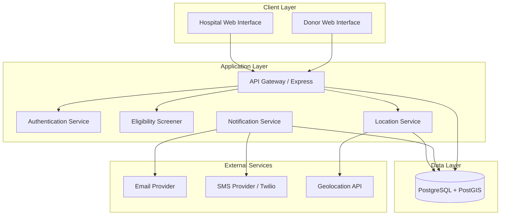
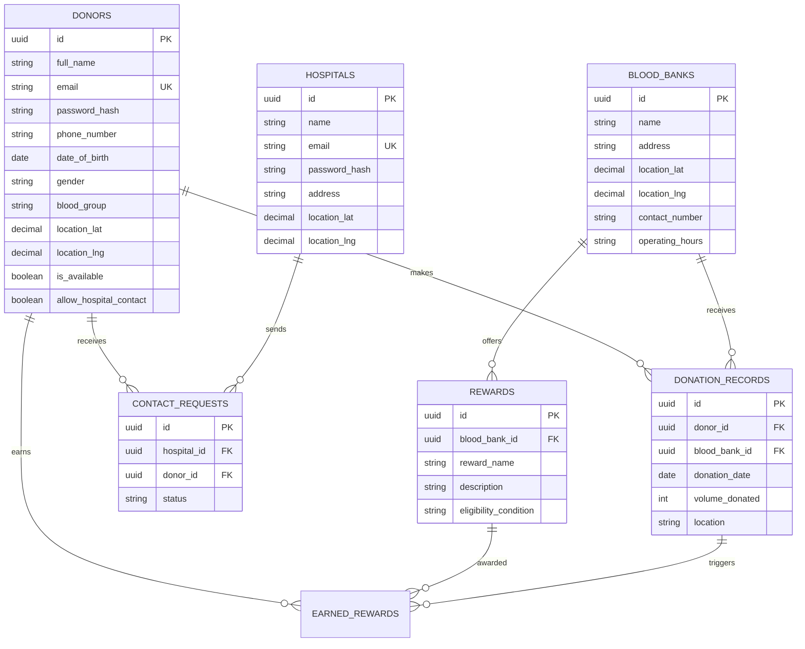

# Design Document: Blood Donation Management System

## Overview

The Blood Donation Management System is a web-based application that connects blood donors with hospitals and blood banks. The system manages the complete donor lifecycle from registration through eligibility screening, donation tracking, and automated reminders. It provides location-based discovery of blood banks and donation camps, facilitates hospital-donor communication, and displays rewards to motivate donations.

The architecture follows a three-tier model with a React-based frontend, Node.js/Express backend, and PostgreSQL database. The system integrates with external services for geolocation, email, and SMS notifications.

## Architecture

### System Components

The system consists of the following major components:

1. **Web Frontend**: React-based single-page application providing donor and hospital interfaces
2. **API Gateway**: Express.js REST API handling authentication, routing, and business logic
3. **Database Layer**: PostgreSQL database storing donor profiles, donation records, blood banks, and camps
4. **Notification Service**: Background service managing scheduled email and SMS notifications
5. **Location Service**: Component integrating browser Geolocation API and geocoding services
6. **Eligibility Screener**: Business logic component evaluating donor eligibility based on health criteria

### Technology Stack

- **Frontend**: React 18, React Router, Leaflet (maps), Axios
- **Backend**: Node.js 18+, Express.js 4.x, JWT for authentication
- **Database**: PostgreSQL 14+, with PostGIS extension for geospatial queries
- **Notification**: Node-cron for scheduling, Nodemailer for email, Twilio for SMS
- **Deployment**: Docker containers, Nginx reverse proxy

### Architecture Diagram



## Components and Interfaces

### 1. Donor Registration Component

**Responsibilities**:
- Collect and validate donor registration data
- Create donor profiles in the database
- Send confirmation emails

**API Endpoints**:
- `POST /api/donors/register` - Register a new donor
- `GET /api/donors/check-email/:email` - Check if email exists

**Input Validation**:
- Email: RFC 5322 format validation
- Phone: E.164 format (international phone numbers)
- Date of birth: Must indicate age >= 18 years
- Blood group: Must be one of [A+, A-, B+, B-, AB+, AB-, O+, O-]
- Gender: Must be one of [Male, Female, Other]

### 2. Eligibility Screener Component

**Responsibilities**:
- Present structured health screening questionnaire
- Evaluate eligibility based on health criteria and donation history
- Calculate next eligible donation date

**Business Rules**:
- Minimum age: 18 years
- Minimum weight: 50 kg
- Minimum donation interval: 3 months (male), 4 months (female)
- Disqualifying conditions: communicable diseases, pregnancy, breastfeeding, recent tattoo/piercing (< 6 months)

**API Endpoints**:
- `POST /api/donors/:id/screening` - Submit screening questionnaire
- `GET /api/donors/:id/eligibility` - Get current eligibility status

**Screening Data Structure**:
```typescript
interface ScreeningData {
  weight: number;
  hasCommunicableDisease: boolean;
  communicableDiseases: string[];
  hasRecentTattoo: boolean;
  medicalConditions: string[];
  isPregnant?: boolean;  // Female only
  isBreastfeeding?: boolean;  // Female only
  lastDonationDate?: Date;
}
```

### 3. Donation History Component

**Responsibilities**:
- Record completed donations
- Display donation history to donors
- Calculate next eligible donation date

**API Endpoints**:
- `POST /api/donations` - Record a new donation
- `GET /api/donors/:id/donations` - Get donation history
- `GET /api/donors/:id/next-eligible-date` - Calculate next eligible date

**Donation Record Structure**:
```typescript
interface DonationRecord {
  id: string;
  donorId: string;
  bloodBankId: string;
  donationDate: Date;
  volumeDonated: number;  // in ml
  location: string;
  bloodBankName: string;
}
```

### 4. Location Service Component

**Responsibilities**:
- Request and process browser geolocation
- Perform geocoding for manual location entry
- Calculate distances between donors and facilities
- Sort facilities by proximity

**API Endpoints**:
- `GET /api/blood-banks/nearby?lat={lat}&lng={lng}&radius={radius}` - Find nearby blood banks
- `GET /api/blood-banks/search?location={location}` - Search by city/postal code
- `GET /api/donation-camps/nearby?lat={lat}&lng={lng}` - Find nearby camps

**Distance Calculation**:
Uses PostGIS `ST_Distance_Sphere` function for accurate geographic distance calculation.

### 5. Hospital-Donor Interaction Component

**Responsibilities**:
- Provide hospital authentication and portal
- Filter donors by blood group, location, and eligibility
- Manage contact requests and donor consent
- Protect donor privacy until consent is granted

**API Endpoints**:
- `POST /api/hospitals/login` - Hospital authentication
- `GET /api/hospitals/donors/search?bloodGroup={bg}&lat={lat}&lng={lng}&radius={radius}` - Search donors
- `POST /api/hospitals/contact-requests` - Send contact request to donor
- `PUT /api/donors/:id/contact-requests/:requestId` - Accept/decline request

**Privacy Model**:
- Initial search results show: blood group, approximate location (city level), availability status
- Full contact details (phone, email) revealed only after donor accepts request

### 6. Notification Service Component

**Responsibilities**:
- Schedule donation reminder notifications
- Send email and SMS notifications
- Respect donor notification preferences

**Implementation**:
- Uses `node-cron` for scheduling
- Runs daily job to check for donors eligible for reminders
- Sends notifications via Nodemailer (email) and Twilio (SMS)

**API Endpoints**:
- `PUT /api/donors/:id/notification-preferences` - Update notification settings

**Notification Preferences Structure**:
```typescript
interface NotificationPreferences {
  emailEnabled: boolean;
  smsEnabled: boolean;
  reminderEnabled: boolean;
}
```

### 7. Rewards Display Component

**Responsibilities**:
- Display rewards offered by blood banks
- Show earned rewards to donors after donation

**API Endpoints**:
- `GET /api/blood-banks/:id/rewards` - Get rewards for a blood bank
- `GET /api/donors/:id/earned-rewards` - Get donor's earned rewards

## Data Models

### Database Schema

```sql
-- Donors table
CREATE TABLE donors (
  id UUID PRIMARY KEY DEFAULT gen_random_uuid(),
  full_name VARCHAR(255) NOT NULL,
  email VARCHAR(255) UNIQUE NOT NULL,
  password_hash VARCHAR(255) NOT NULL,
  phone_number VARCHAR(20) NOT NULL,
  date_of_birth DATE NOT NULL,
  gender VARCHAR(10) NOT NULL CHECK (gender IN ('Male', 'Female', 'Other')),
  blood_group VARCHAR(3) NOT NULL CHECK (blood_group IN ('A+', 'A-', 'B+', 'B-', 'AB+', 'AB-', 'O+', 'O-')),
  location_lat DECIMAL(10, 8),
  location_lng DECIMAL(11, 8),
  location_city VARCHAR(100),
  is_available BOOLEAN DEFAULT true,
  allow_hospital_contact BOOLEAN DEFAULT true,
  email_notifications_enabled BOOLEAN DEFAULT true,
  sms_notifications_enabled BOOLEAN DEFAULT true,
  reminder_notifications_enabled BOOLEAN DEFAULT true,
  created_at TIMESTAMP DEFAULT CURRENT_TIMESTAMP,
  updated_at TIMESTAMP DEFAULT CURRENT_TIMESTAMP,
  last_login TIMESTAMP,
  failed_login_attempts INT DEFAULT 0,
  account_locked_until TIMESTAMP
);

-- Donation records table
CREATE TABLE donation_records (
  id UUID PRIMARY KEY DEFAULT gen_random_uuid(),
  donor_id UUID NOT NULL REFERENCES donors(id) ON DELETE CASCADE,
  blood_bank_id UUID NOT NULL REFERENCES blood_banks(id),
  donation_date DATE NOT NULL,
  volume_donated INT NOT NULL,
  location VARCHAR(255),
  created_at TIMESTAMP DEFAULT CURRENT_TIMESTAMP
);

-- Blood banks table
CREATE TABLE blood_banks (
  id UUID PRIMARY KEY DEFAULT gen_random_uuid(),
  name VARCHAR(255) NOT NULL,
  address VARCHAR(500) NOT NULL,
  city VARCHAR(100) NOT NULL,
  location_lat DECIMAL(10, 8) NOT NULL,
  location_lng DECIMAL(11, 8) NOT NULL,
  contact_number VARCHAR(20),
  operating_hours VARCHAR(100),
  created_at TIMESTAMP DEFAULT CURRENT_TIMESTAMP
);

-- Rewards table
CREATE TABLE rewards (
  id UUID PRIMARY KEY DEFAULT gen_random_uuid(),
  blood_bank_id UUID NOT NULL REFERENCES blood_banks(id) ON DELETE CASCADE,
  reward_name VARCHAR(255) NOT NULL,
  description TEXT,
  eligibility_condition VARCHAR(100),
  created_at TIMESTAMP DEFAULT CURRENT_TIMESTAMP,
  updated_at TIMESTAMP DEFAULT CURRENT_TIMESTAMP
);

-- Donation camps table
CREATE TABLE donation_camps (
  id UUID PRIMARY KEY DEFAULT gen_random_uuid(),
  name VARCHAR(255) NOT NULL,
  organizer VARCHAR(255) NOT NULL,
  camp_date DATE NOT NULL,
  camp_time VARCHAR(50),
  venue VARCHAR(255) NOT NULL,
  address VARCHAR(500) NOT NULL,
  location_lat DECIMAL(10, 8) NOT NULL,
  location_lng DECIMAL(11, 8) NOT NULL,
  goodies TEXT,
  created_at TIMESTAMP DEFAULT CURRENT_TIMESTAMP
);

-- Hospitals table
CREATE TABLE hospitals (
  id UUID PRIMARY KEY DEFAULT gen_random_uuid(),
  name VARCHAR(255) NOT NULL,
  email VARCHAR(255) UNIQUE NOT NULL,
  password_hash VARCHAR(255) NOT NULL,
  address VARCHAR(500) NOT NULL,
  location_lat DECIMAL(10, 8) NOT NULL,
  location_lng DECIMAL(11, 8) NOT NULL,
  contact_number VARCHAR(20),
  created_at TIMESTAMP DEFAULT CURRENT_TIMESTAMP
);

-- Contact requests table
CREATE TABLE contact_requests (
  id UUID PRIMARY KEY DEFAULT gen_random_uuid(),
  hospital_id UUID NOT NULL REFERENCES hospitals(id) ON DELETE CASCADE,
  donor_id UUID NOT NULL REFERENCES donors(id) ON DELETE CASCADE,
  status VARCHAR(20) NOT NULL CHECK (status IN ('pending', 'accepted', 'declined')),
  created_at TIMESTAMP DEFAULT CURRENT_TIMESTAMP,
  responded_at TIMESTAMP
);

-- Earned rewards table
CREATE TABLE earned_rewards (
  id UUID PRIMARY KEY DEFAULT gen_random_uuid(),
  donor_id UUID NOT NULL REFERENCES donors(id) ON DELETE CASCADE,
  reward_id UUID NOT NULL REFERENCES rewards(id) ON DELETE CASCADE,
  donation_record_id UUID NOT NULL REFERENCES donation_records(id) ON DELETE CASCADE,
  earned_at TIMESTAMP DEFAULT CURRENT_TIMESTAMP
);

-- Indexes for performance
CREATE INDEX idx_donors_email ON donors(email);
CREATE INDEX idx_donors_blood_group ON donors(blood_group);
CREATE INDEX idx_donors_location ON donors USING GIST(ST_MakePoint(location_lng, location_lat));
CREATE INDEX idx_donation_records_donor ON donation_records(donor_id);
CREATE INDEX idx_donation_records_date ON donation_records(donation_date);
CREATE INDEX idx_blood_banks_location ON blood_banks USING GIST(ST_MakePoint(location_lng, location_lat));
CREATE INDEX idx_donation_camps_date ON donation_camps(camp_date);
CREATE INDEX idx_contact_requests_donor ON contact_requests(donor_id);
CREATE INDEX idx_contact_requests_hospital ON contact_requests(hospital_id);
```

### Entity Relationships




## Correctness Properties

*A property is a characteristic or behavior that should hold true across all valid executions of a system — essentially, a formal statement about what the system should do. Properties serve as the bridge between human-readable specifications and machine-verifiable correctness guarantees.*

### Property 1: Registration rejects underage donors

*For any* date of birth that results in an age strictly less than 18 years at the time of registration, the system shall reject the registration and not create a donor profile.

**Validates: Requirements 1.4**

---

### Property 2: Registration validates required fields

*For any* registration payload missing one or more required fields (full name, blood group, phone, email, date of birth, gender, location), or containing a malformed email or invalid blood group/gender value, the system shall reject the request and return a validation error.

**Validates: Requirements 1.2, 1.5, 1.6**

---

### Property 3: Eligibility disqualification for health conditions

*For any* screening submission where the donor reports a communicable disease, is pregnant, or is breastfeeding, the Eligibility Screener shall mark the donor as ineligible and return a disqualification message.

**Validates: Requirements 2.9, 2.10, 2.11**

---

### Property 4: Eligibility rejects low weight donors

*For any* screening submission where the reported weight is strictly less than 50 kg, the Eligibility Screener shall mark the donor as ineligible.

**Validates: Requirements 2.4**

---

### Property 5: Eligibility rejects donors within minimum donation interval

*For any* donor and any last donation date, if the time elapsed since that donation is less than 3 months (for male donors) or 4 months (for female donors), the Eligibility Screener shall mark the donor as ineligible.

**Validates: Requirements 2.13**

---

### Property 6: Donation history is returned in reverse chronological order

*For any* donor with multiple donation records, the list returned by the donation history endpoint shall be sorted in descending order by donation date (most recent first).

**Validates: Requirements 3.2**

---

### Property 7: Next eligible date calculation is correct

*For any* donor and their most recent donation date, the calculated next eligible donation date shall be exactly 3 months after the donation date for male donors and exactly 4 months after for female donors.

**Validates: Requirements 3.3**

---

### Property 8: Donation count matches stored records

*For any* donor, the total donation count displayed on their profile shall equal the number of donation records stored for that donor.

**Validates: Requirements 3.5**

---

### Property 9: Blood bank search results are sorted by distance

*For any* donor location and set of blood banks, the search results returned by the Location Service shall be sorted in ascending order by geographic distance from the donor's location.

**Validates: Requirements 4.2**

---

### Property 10: Donor search respects all filters and privacy rules

*For any* hospital search query, the results shall contain only donors who: (a) match the requested blood group, (b) are within the specified location radius, (c) are marked as eligible, (d) have opted in to hospital contact, and (e) are set to "Available". Furthermore, the results shall not include the donor's phone number or email address unless the donor has accepted a contact request from that hospital.

**Validates: Requirements 5.2, 5.4, 5.6, 6.2, 6.3**

---

### Property 11: Donation reminder is scheduled at the correct gender-based interval

*For any* completed donation record, the Notification Service shall schedule a reminder notification for exactly 3 months after the donation date for male donors and exactly 4 months after for female donors.

**Validates: Requirements 9.1, 9.2**

---

### Property 12: Opted-out donors do not receive notifications

*For any* donor who has opted out of reminder notifications, the Notification Service shall not send any reminder notifications to that donor, regardless of their eligibility status.

**Validates: Requirements 9.5**

---

### Property 13: Reminder notification content is complete

*For any* reminder notification sent by the Notification Service, the notification shall include an encouragement message, a link to find nearby blood banks, and the donor's current eligibility status.

**Validates: Requirements 9.4**

---

### Property 14: Unauthenticated requests to protected endpoints are rejected

*For any* request to a donor-protected endpoint (profile, donation history, screening) that does not include a valid authentication token, the system shall return a 401 Unauthorized response.

**Validates: Requirements 10.1**

---

### Property 15: Active donation camps are filtered by date

*For any* query to the donation camps listing, the results shall contain only camps whose date is on or after the current date.

**Validates: Requirements 8.3**

---

## Error Handling

### Validation Errors (400 Bad Request)
- Missing required fields in registration or screening
- Invalid blood group or gender values
- Malformed email address or phone number
- Age below 18 in registration

### Authentication Errors (401 Unauthorized)
- Missing or expired JWT token
- Invalid credentials on login
- Account locked due to failed attempts

### Authorization Errors (403 Forbidden)
- Hospital attempting to access donor personal details before acceptance
- Donor accessing another donor's profile

### Not Found Errors (404 Not Found)
- Blood bank, camp, or donor not found by ID

### Conflict Errors (409 Conflict)
- Duplicate email on registration

### Rate Limiting (429 Too Many Requests)
- Excessive login attempts before account lockout threshold

### Error Response Format

All API errors follow a consistent JSON structure:

```json
{
  "error": {
    "code": "VALIDATION_ERROR",
    "message": "Human-readable error message",
    "details": ["field-level error details if applicable"]
  }
}
```

### Account Lockout Flow

After 5 consecutive failed login attempts:
1. Set `account_locked_until = NOW() + 15 minutes`
2. Reset `failed_login_attempts = 0`
3. Send lockout notification email to donor
4. Return 401 with lockout message and unlock time

### Session Expiry

JWT tokens are issued with a 30-minute expiry. The frontend refreshes the token on activity. If no activity occurs for 30 minutes, the token expires and the user is redirected to login.

---

## Testing Strategy

### Dual Testing Approach

Both unit tests and property-based tests are required for comprehensive coverage. They are complementary:
- **Unit tests** verify specific examples, integration points, and error conditions
- **Property-based tests** verify universal properties across many generated inputs

### Unit Testing

Unit tests focus on:
- Specific registration and login flows (happy path and error cases)
- Eligibility screener with known inputs (e.g., pregnant female, weight=49kg)
- Donation history display with a fixed set of records
- Notification scheduling with a known donation date
- Account lockout after exactly 5 failed attempts
- Password reset link generation and expiry
- Hospital search returning correct filtered results for a known dataset

**Framework**: Jest (Node.js backend), React Testing Library (frontend)

### Property-Based Testing

Property-based tests verify the 15 correctness properties defined above. Each test generates random inputs and verifies the property holds.

**Framework**: `fast-check` (JavaScript/TypeScript property-based testing library)

**Configuration**: Each property test runs a minimum of 100 iterations.

**Tag format**: `Feature: blood-donation-management-system, Property {N}: {property_text}`

#### Property Test Mapping

| Property | Test Description | Generator |
|----------|-----------------|-----------|
| P1 | Registration rejects underage dates of birth | Random dates resulting in age < 18 |
| P2 | Registration rejects invalid/incomplete payloads | Random payloads with missing/malformed fields |
| P3 | Disqualifying health conditions result in ineligibility | Random screening data with at least one disqualifier |
| P4 | Weight < 50 kg results in ineligibility | Random weights in range [0, 49.99] |
| P5 | Donation within interval results in ineligibility | Random donation dates within 3/4 month window |
| P6 | Donation history sorted descending | Random sets of donation records |
| P7 | Next eligible date is exactly 3/4 months after donation | Random donation dates and genders |
| P8 | Donation count matches record count | Random donation record sets |
| P9 | Blood bank results sorted by distance | Random blood bank coordinates and donor locations |
| P10 | Donor search respects all filters and privacy | Random donor datasets with mixed attributes |
| P11 | Reminder scheduled at correct interval | Random donation dates and genders |
| P12 | Opted-out donors excluded from notifications | Random donor sets with mixed opt-out status |
| P13 | Reminder notification contains required content | Random donor data |
| P14 | Unauthenticated requests rejected | Random protected endpoint requests without tokens |
| P15 | Past camps excluded from listing | Random camp sets with mixed past/future dates |

### Integration Testing

Integration tests cover:
- Full registration flow (form submission → DB record → confirmation email)
- Full donation recording flow (screening → record → eligibility update → reminder scheduled)
- Hospital search and contact request flow (search → request → donor accept → details revealed)
- Notification delivery (scheduled job fires → email/SMS sent)

### Test Data Management

- Use database transactions rolled back after each test for isolation
- Seed scripts for blood banks, hospitals, and rewards data
- Mock external services (email, SMS, geolocation) in all automated tests
